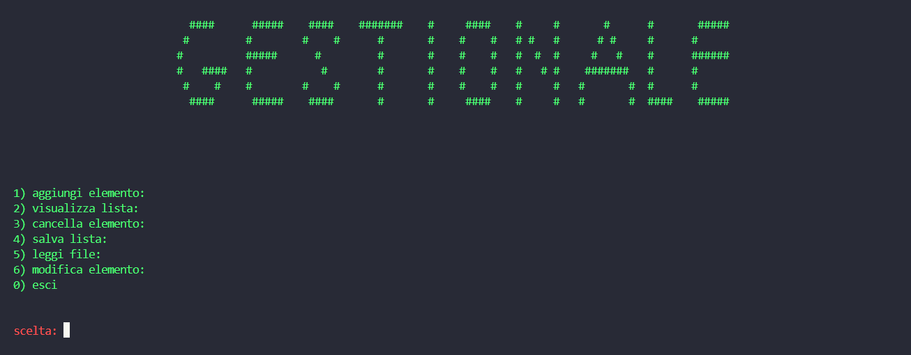

programma che gira su console per compilarlo uso gcc: gcc gestionale.c func.c -o gest.exe

è possibile: 
- inserire elementi nuovi (titolo,autore,prezzo)
- leggere la lista
- cancellare un elemento
- scrivere su file 
- leggere e importare da file
- modificare un elemento
